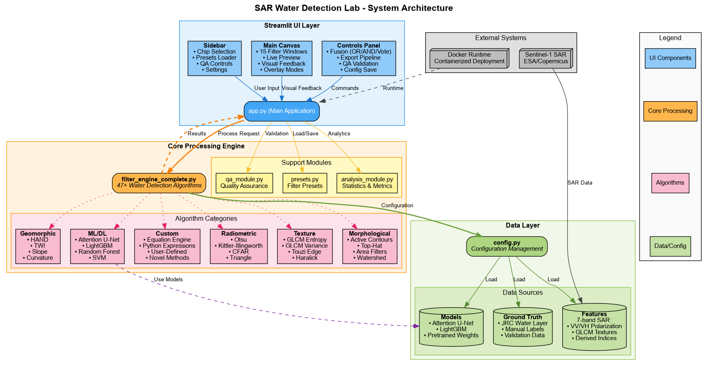

# 🌊 SAR Water Detection Lab

```
   _____ ___    ____     _       __      __            ____       __            __  _           
  / ___//   |  / __ \   | |     / /___ _/ /____  _____/ __ \___  / /____  _____/ /_(_)___  ____ 
  \__ \/ /| | / /_/ /   | | /| / / __ `/ __/ _ \/ ___/ / / / _ \/ __/ _ \/ ___/ __/ / __ \/ __ \
 ___/ / ___ |/ _, _/    | |/ |/ / /_/ / /_/  __/ /  / /_/ /  __/ /_/  __/ /__/ /_/ / /_/ / / / /
/____/_/  |_/_/ |_|     |__/|__/\__,_/\__/\___/_/  /_____/\___/\__/\___/\___/\__/_/\____/_/ /_/ 
                                                                                                 
```

<div align="center">


**Interactive tool for detecting water bodies from SAR satellite imagery**

[🚀 Quick Start](#-quick-start) • [📖 Documentation](#-documentation) • [🎯 Features](#-features) • [🤝 Contributing](#-contributing)

</div>

---

## 📸 Screenshots

<div align="center">

### Main Interface


### Filter Configuration


### Results Visualization


</div>

---

## 🎯 Features

### 🔬 47+ Water Detection Algorithms

<table>
<tr>
<td width="50%">

**Classical Methods**
- ✅ Otsu & Kittler-Illingworth Thresholding
- ✅ Hysteresis & Adaptive Sauvola
- ✅ GLCM Texture Analysis
- ✅ Morphological Operations
- ✅ HAND Terrain Integration

</td>
<td width="50%">

**Advanced Methods**
- 🧠 Attention U-Net (Deep Learning)
- 📊 LightGBM Ensemble
- 🌊 Active Contours (Morphological Snake)
- 🎯 CFAR Detection
- 🔍 Custom Equation Engine

</td>
</tr>
</table>

### 🛠️ Capabilities

| Feature | Description |
|---------|-------------|
| **Real-time Tuning** | Adjust parameters and see results instantly |
| **Multi-Algorithm Fusion** | Combine 15 filters with OR/AND/Vote modes |
| **Quality Assurance** | Built-in QA system with audit trails |
| **Custom Equations** | Write Python expressions for novel algorithms |
| **Export Pipeline** | Save configurations and results |
| **Production Ready** | Docker deployment with health checks |

---

## 🚀 Quick Start

### Using Docker (Recommended)

```bash
# 1. Clone repository
git clone https://github.com/Neeraj-Parekh/sar-water-detection-lab.git
cd sar-water-detection-lab/chips/gui

# 2. Start application
docker-compose up -d

# 3. Open browser
open http://localhost:8501

# 4. Stop when done
docker-compose down
```

### Local Installation

```bash
# 1. Create virtual environment
python3 -m venv venv
source venv/bin/activate  # Windows: venv\Scripts\activate

# 2. Install dependencies
pip install -r requirements.txt

# 3. Configure paths
cp .env.example .env
# Edit .env and set SAR_DATA_ROOT

# 4. Run application
streamlit run app.py
```

**📚 See [QUICKSTART.md](QUICKSTART.md) for detailed instructions**

---

## 📊 Data Format

### Input Requirements

The application expects **7-band GeoTIFF** files with the following structure:

```
File: chip_001_features_7band_f32.tif

Band 1: VV polarization (dB)     │ -35 to 5
Band 2: VH polarization (dB)     │ -35 to 5  
Band 3: MNDWI (index)             │ -1 to 1
Band 4: DEM (meters)              │ 0 to 3000
Band 5: HAND (meters)             │ 0 to 100
Band 6: Slope (degrees)           │ 0 to 90
Band 7: TWI (index)               │ 0 to 30
```

### Directory Structure

```
your_data/
├── chips/processed/features_7band/
│   ├── chip_001_features_7band_f32.tif
│   ├── chip_002_features_7band_f32.tif
│   └── ...
├── chips/processed/labels_verified/
│   ├── chip_001_label_verified_u8.tif
│   └── ...
└── chips/processed/exports/
    └── (outputs)
```

---

## 💡 Usage Examples

### Example 1: Simple VH Threshold

```python
# Window 1: Simple Threshold
Filter: Simple Threshold
  - Band: VH
  - Threshold: -19.0 dB
  
Result: Basic water detection (rivers, lakes)
```

### Example 2: Terrain-Constrained Detection

```python
# Window 1: VH Threshold
Filter: Simple Threshold (VH < -19)

# Window 2: HAND Filter  
Filter: HAND Definite (HAND < 5m)

# Window 3: Slope Filter
Filter: Custom Equation
  Equation: slope < 10.0

Fusion: Majority Vote
Result: High-confidence water in valleys
```

### Example 3: Custom Equation

```python
Filter: Custom Equation
Equation: (vh < -19.0) & (hand < 5.0) & (glcm_entropy < 2.0)

Result: Smooth, low-lying water bodies
```

---

## 🏗️ Architecture

<div align="center">



</div>

**System Overview:**

The SAR Water Detection Lab follows a **3-layer architecture**:

1. **UI Layer** (`app.py`) - Streamlit interface with sidebar, canvas, and control panels
2. **Core Engine** (`filter_engine_complete.py`) - 47+ water detection algorithms across 6 categories
3. **Data Layer** (`config.py`) - Manages SAR features, ground truth labels, and ML models

**Key Components:**
- **Radiometric**: Otsu, CFAR, Kittler-Illingworth thresholding
- **Texture**: GLCM entropy/variance, Touzi edge detection
- **Morphological**: Active contours, watershed, area filters
- **Geomorphic**: HAND, TWI, slope constraints
- **ML/DL**: Attention U-Net, LightGBM, Random Forest
- **Custom**: Python equation engine for novel algorithms

> 📄 View the architecture source: [architecture.dot](architecture.dot)

---

## 📈 Performance

| Metric | Value |
|--------|-------|
| **Throughput** | 10-15 chips/minute (512x512px) |
| **Memory** | 2-4GB per worker |
| **Latency** | <1s for simple filters, 2-5s for ML |
| **Algorithms** | 47+ methods available |
| **Scalability** | Docker + multi-worker support |

---

## 🧪 Development

### Setup Dev Environment

```bash
# Install with dev dependencies
pip install -r requirements.txt
pip install black flake8 pytest mypy

# Format code
black *.py

# Run linter
flake8 *.py --max-line-length=100

# Type check
mypy app.py --ignore-missing-imports
```

### Project Structure

```
chips/gui/
├── app.py                      # Main application
├── config.py                   # Configuration management
├── filter_engine_complete.py   # 47+ algorithms
├── analysis_module.py          # Analysis utilities
├── qa_module.py                # QA system
├── presets.py                  # Filter presets
├── requirements.txt            # Dependencies
├── Dockerfile                  # Container definition
├── docker-compose.yml          # Orchestration
├── README.md                   # This file
├── QUICKSTART.md               # Getting started
├── CONTRIBUTING.md             # Contribution guide
└── LICENSE                     # MIT License
```

---

## 🤝 Contributing

We welcome contributions! Please see [CONTRIBUTING.md](CONTRIBUTING.md) for guidelines.

**Ways to Contribute:**
- 🐛 Report bugs
- 💡 Suggest features  
- 📝 Improve documentation
- 🔧 Add new algorithms
- 🧪 Write tests

---

## 📝 License

This project is licensed under the MIT License - see [LICENSE](LICENSE) for details.

---

## 🙏 Acknowledgments

- **ESA Sentinel-1**: SAR imagery provider
- **Streamlit**: Interactive web framework
- **GDAL/Rasterio**: Geospatial processing
- **PyTorch**: Deep learning framework

---

## 📧 Support

- **Issues**: [GitHub Issues](https://github.com/Neeraj-Parekh/sar-water-detection-lab/issues)
- **Discussions**: [GitHub Discussions](https://github.com/Neeraj-Parekh/sar-water-detection-lab/discussions)
- **Documentation**: [Wiki](https://github.com/Neeraj-Parekh/sar-water-detection-lab/wiki)

---

## 🗺️ Roadmap

### v1.0.0 (Current)
- ✅ 47+ water detection algorithms
- ✅ Interactive Streamlit interface
- ✅ Docker deployment
- ✅ Configuration management

### v1.1.0 (Planned)
- [ ] Unit tests (pytest)
- [ ] CI/CD pipeline
- [ ] Performance benchmarks
- [ ] Example datasets

### v2.0.0 (Future)
- [ ] Multi-user support
- [ ] REST API
- [ ] Cloud deployment guides
- [ ] Model versioning

---

<div align="center">

**Built with ❤️ for the remote sensing community**

⭐ Star this repo if you find it useful!

</div>
